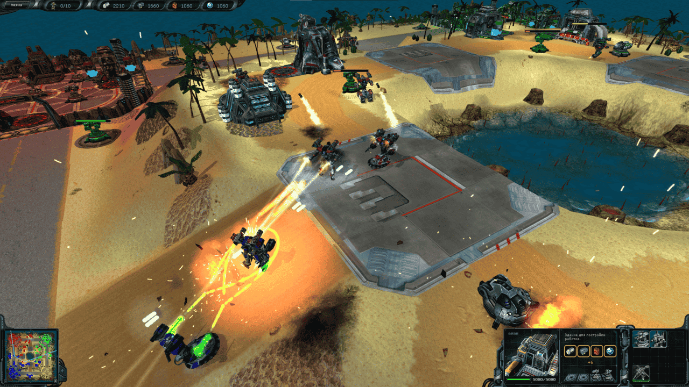

# MatrixGame Networking
Forked from https://github.com/vladislavrv/MatrixGame

## Architecture 
Lockstep with Server Relay

## Roadmap

- Disable enemy's AIs ✔️
- Make red/green/blue robots controllable by the player ✔️
- Harness the Tick() function ❌
- Add the state manager singleton ❌
- Remove the player's ability to control robots, construct etc... ❌ 
- Add Actions, the variable for storing the list of actions for the current frame to StateManager and poll it in loop to apply in game as if they were executed by some side ❌
- Make player being able to form new Actions adding them to the variable(so it looks like the player can control robots now again) ❌
- Add fate control with environment variables `CLIENT1`, `CLIENT2` ❌
- Functionality to launch two instances at once and move them to screen corners ❌
- Make the Clients freeze at frame 0 waiting for the connection and game to start ❌
- Add the Relay Server as separate executable ❌
- Add the ENet library ❌
- Add Message functionality to allow for Client-Server, Server-Client and Client-Server-Client communication, add message loop handlers to process incoming msgs ❌
- Add Server command to start the game ❌
- Send sampled inputs to other clients ❌
- When there are inputs present for the frame for all the players process next Tick() ❌
- When there is no sampled inputs for the duration of 1 frame assign Empty List of Actions to the var of Inputs for current frame and send it ❌
- Make sure at least some basic Determinism is present ❌
- Add buffer for inputs delay to address jitter(i.e. replace the variable string the List of Actions for the current frame with some kind of data struct storing the Lists of Actions for number of frames) ❌
- Add more fancy functionality to control the flow of the game. Allow configuring IP addresses to connect, maps to play etc. ❌

The rest is from the original repository:

<hr>
<hr>

## MatrixGame - Space Rangers 2 Planetary Battles Engine


Original sources: http://snk-games.net/matrixgame.tar.gz<br>
Mirror of the original sources on Github: https://github.com/twoweeks/MatrixGame<br>
Forked from (repo with some updates and fixes): https://github.com/murgesku/MatrixGame

---

The purpose of this repo is to make the game great again.

Not only from the gameplay perspective, but the code itself. Think of it as of C++ exercise, where you can use all your knowledge and full power of C++ (almost) to make this world better.

Improve pathfinding algorithm? Create better robots AI? If you'd like to be a part of it — see **Contribution** section below.

## Dependencies
The game uses `DirectX 9 API`, so it requires DirectX SDK with corresponding headers/libs to be installed. 
In the original repo the `DirectX SDK (June 2010)` has been used, and as it works I see no reason to change it.

Fortunately you can simply use the commands from the [workflow file](https://github.com/vladislavrv/MatrixGame/blob/ae6bf8ef127642e9a3d82825a5d05fa867a83808/.github/workflows/win-build.yml) ("Get DXSDK" section) to get everything you need. Just don't forget to configure the `DXSDK_DIR` environment variable.

But if you are using the **MinGW32** compiler then you do **NOT** need to install the DirectX 9 at all because it is shipped alongside the compiler.

## Building

Only `x86` game build exists, so you have no reason to build the `x64` version of this project. Even if you try it will not work. So don't do it.

Depending on the build options, the output artifact is either a standalone executable file `(.EXE)` that can be run independently or a library `(.DLL)` to be used directly with the Space Rangers 2 game.

Options:
- `MATRIXGAME_BUILD_DLL` - build DLL [default: `TRUE`]<br>
- `MATRIXGAME_CHEATS` - enable in-game cheats [default: `TRUE`]
- `MATRIXGAME_PKG_BRING_FROM_GAME` - if you build EXE then auto copy PKG files from the Space Rangers 2 game [default: `TRUE`]
- `MATRIXGAME_PKG_SPACE_RANGERS` - if you want to copy PKG file for EXE build this is the path of the game [default: `C:/Program Files (x86)/Steam/steamapps/common/Space Rangers HD A War Apart`]
- `MATRIXGAME_PKG_SYMLINK` - Symlink the PKG file instead of copying to avoid extra space consumption. Requires admin on Windows! 

There are different approaches to build the project, just choose the one you like.

### Historical way (does not work anymore)
The original source code pack included Visual Studio 2010 project/solution files and was intended to be built using VS2010-2012 (in fact, any newer version should work too).

Base repo (the one this was forked from) added CMake files and changed code folder structure to improve and simplify building process.

After refactoring done in this repo (which brought modern C++ standards support) versions before VS17 2022 might not work anymore, so we're coming to...

### Canonical way (for now)
MS Visual Studio 17 2022 or newer is required, together with dependencies described above. Put your version to -G argument or remove it so CMake will use default one.

    cmake -A Win32 -G "Visual Studio 17 2022" -B ./build ..
    cmake --build ./build

Or you could use the CMake GUI, if you want.

See what's happening, check the final binary path at the end and find your game file.

### Alternative way (maybe future canonical)
The main purpose of the first refactoring steps was to make the project buildable with GCC.

To go this way you have to [download a GCC build](https://winlibs.com/) (most recent one is recommended; also remember you need the **32-bit** build), unpack it and add the `bin/` directory path to your PATH environment variable.

Also, I strongly recommend using the [Ninja build system](https://ninja-build.org/) instead of MinGW native mingw32-make, 'cause building with the latter is __extremely__ slow. Add it to your PATH too, or just copy to the mingw `bin/` folder — it's just a single small executable.

After preparing your env you can use the CMake to do the work for you:

    cmake -G "Ninja" -B ./build ..
    cmake --build ./build

Anyway, personally I prefer exactly this option 'cause it's much easier to update 
(download about 100MB zip and unpack versus installing several gigabytes of MSVS software bundle, which includes tons of tools I've never asked for).
It always provides the most recent implementation of C++ libs and features (even the ones that on TS stage and not released yet) and it includes the DirectX libs, so you don't even have to bother about dependencies.

The only disadvantage of this option comparing to MSVC is you cannot use the Visual Studio fancy debugging environment.
The most viable alternative would be debugging in CLion or VSCode (which has to be set up properly). 

This way will probably become the new canonical one day.

---

It is also possible to cross compile on Linux, see [docs/CROSS_COMPILATION.md](docs/CROSS_COMPILATION.md).

## Testing

There are no unit-tests, and in fact no any other sort of tests. In general to test the game - play it! If it runs - that's already a good sign. If it works and does not crash - perfect, it's not broken. If you're too lazy even to play - build the game with cheats enabled and use _AUTO_ cheat for game to play itself. Just keep an eye on it and feel free to call it "self-testing" ;)

Of course if you've just updated some specific aspect of the game - you'd better focus on testing that specific part.

There are two ways to playtest it...

### Build as a DLL (canonical way)

Simply replace the library file in the **Space Rangers 2** game folder (`MatrixGame.dll`) with the one from the build folder.

Then run the game and start a battle from menu — everything should work smooth and fine. If it's not - well, something went wrong.  

### Build as an EXE (alternative way)

You will need a specific folder structure with all the resources:
```
game (top-level folder; name does not matter, it might be your build folder)
├ cfg
│ └ robots.dat (created by CMake or taken from the game)
├ data
│ └ robots.pkg (copied from the game by CMake or manually)
└ MatrixGame.exe (your built executable)
```
In fact the CMake will create the `CFG/` folder with the `robots.dat` automatically during configuration. 

The `DATA/` folder will also be created, but the `robots.pkg` cannot be distributed here because of the licence so you need to take it from the game.
By default, CMake will try to copy `robots.pkg` using `MATRIXGAME_PKG_SPACE_RANGERS` as the path to the game.

## Contribution
The whole project is a bunch of low-quality C++ code from the late 90x. There is a huge space for improvement, so feel free to just take any part and refactor it as you wish.

This project implements and uses its own memory management system (see `MatrixLib/Base/CHeap.hpp`), which in fact does not introduce any custom functions and simply wraps the calls of windows-style memory-management function (like `HeapAlloc`). So feel free to use C++ standard library with any of its features supported by compilers.

Once you have prepared some update and tested it — create a pull request, it will automatically be checked for compatibility with both MSVC and GCC. Approval of the request is not formally required but is always considered a good practice.

If you've found any bugs while playing the game — feel free to create an issue and provide as many details about the problem as you can. It might happen that someone will fix it :grin:

## License
According to the copyright holder's permission, the source code of the MatrixGame engine itself (the content of the MatrixGame and MatrixLib directories) is released as open source and should continue to be distributed under the GNU General Public License v2 or a newer one.

The game engine uses [libpng](https://github.com/glennrp/libpng/) and [zlib](https://github.com/madler/zlib) distributed under their own licences and terms. No one in Elemental Games, Katauri Interactive, or CHK-Games claims authorship or any other proprietary or exclusive rights, nor can change original distribution terms.
